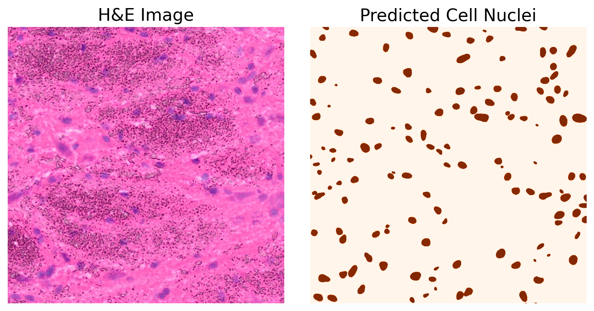
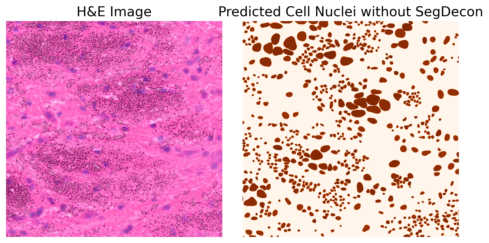

# SegDecon
AI-powered nuclei segmentation enhances histological image process and Spatial Transcriptomics deconvolution
Spatial transcriptomics (ST) enables spatially resolved gene expression profiling but is often limited by low resolution. To address this, we introduce SegDecon, an AI-powered pipeline that enhances tissue segmentation using histology color data and refines cell-type estimates with cell count-informed deconvolution. Validated on high-resolution datasets, SegDecon outperforms existing methods and is available at . Beyond deconvolution, it supports broader applications in nuclei and cell segmentation-based analyses.

# Pipeline

This repository contains the code for processing, segmenting, and analyzing spatial transcriptomics data using deep learning models like Stardist and deconvolution methods like Cell2location.

# Tutorials
The tutorial covers all aspects of pipeline and has clearer explanations. It is recommended to refer to the tutorial for SegDecon.

## Pipeline Overview

1. **Preprocessing and Segmentation** (`denoising_and_segmentation.py`)
   - Download and preprocess tissue images.
   - Perform nuclei segmentation using Stardist.
> *Note: Here, we provide **3** methods to set the noise mask: **default**, **KMeans-based** and **manually set**.*

- **Default**:
here default noise mask is:  
lower_color = np.array([154, 137, 107])  # Lower noise limits of H, S, V
upper_color = np.array([162, 207, 211])  # Upper noise limits of H, S, V

Default replacement color is:  
replacement_color = np.array([160, 115, 250], dtype=np.uint8)    

To accommodate diverse datasets, SegDecon provides a KMeans-based method for dynamically determining the optimal hue threshold.(`kmeans_noise_filter.py` or the notebook :). This approach clusters pixel colors into different groups and selects the cluster corresponding to noise artifacts. However, for precise noise removal, a hybrid approach is recommended, where the manually selected thresholds are refined by taking the union of hue values from at least **ten** representative noise pixels. This combined strategy ensures more accurate and dataset-specific noise suppression while maintaining robust segmentation performance.

- **KMeans-based method**: `kmeans_noise_filter.py`

The comparison of segmentation effects after segdecon denoising is as follows：  
  VS.

2. **Deconvolution** (`deconvolution.py`)
   - Perform deconvolution using Cell2location to assign spatial cell abundances.
   - Train a Cell2location model with the spatial transcriptomics data.
- Note: The following deconvolution process is based on Cell2location, with **SegDecon** providing modifications to hyperparameters at key steps.
- The feature extraction for the scRNA reference is based on the methodology described in the following link: [Cell2location Tutorial – Estimation of Reference Cell Type Signatures (NB Regression)](https://cell2location.readthedocs.io/en/latest/notebooks/cell2location_tutorial.html#Estimation-of-reference-cell-type-signatures-(NB-regression)).*
  
3. **Postprocessing** (`postprocess.py`)
   - Post-process the results, visualize cell abundances, and save final data.

## Installation
We recommend using distinct environments for SegDecon, as the segmentation module requires TensorFlow while the deconvolution module requires PyTorch.

1. Clone this repository:
git clone https://github.com/CiiM-Bioinformatics-group/SegDecon.git cd SegDecon

3. Set up the environment using Conda:
conda env create -f environment.yml conda activate SegDecon

## Running the Pipeline

Execute the pipeline by running the following script:
SegDecon/Pipeline/Denoising and segmentation.py 
SegDecon/Pipeline/deconvolution.py 
SegDecon/Pipeline/postprocess.py

## Results

The processed and analyzed data will be saved in the `data/` folder, including:
- `deconvolution_input.h5ad`
- `deconvolution_output.h5ad`
- `segdecon_results.h5ad`
